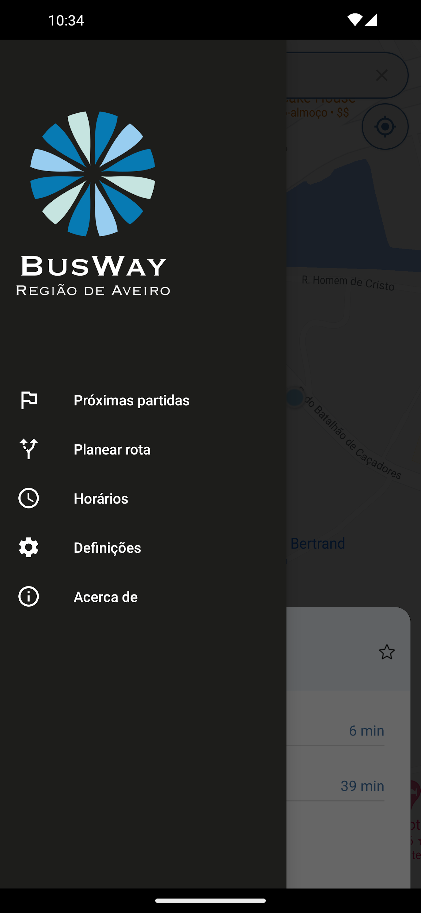
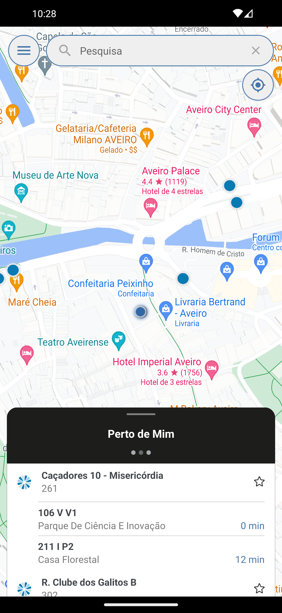
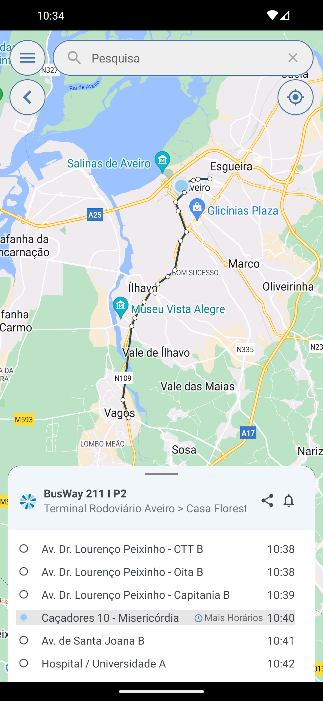

# Competitor Analysis: BusWay App 
## General Information 
- **Name of System:** BusWay App 
- **Company/Developer:** BusWay 
- **Website/Product Page:** [BusWay Website](https://busway-cira.pt/) 
- **Version/Release Date:** 17-10-2024
- **Platform(s) Supported:** Mobile (iOS/Android) 
- **Target Audience:** "Residentes e visitantes da região de Aveiro que utilizam os transportes públicos para deslocações urbanas e intermunicipais. Inclui passageiros de todas as idades, com ofertas específicas para crianças, estudantes, adultos e seniores. O serviço também atende turistas interessados em explorar a região através de opções de transporte acessíveis e convenientes." - *Retirado do website da BusWay*

--- 
## Core Functionality 
**Primary Purpose:** 
	
	- Allow Users to consult bus routes, its timetables and fares.
	
**Key Features:** 

	- Live Bus Tracking;
	- Timetable and Route Information;
	- Monthly Pass Recharge via the app;
**Unique Selling Points (USPs):** 
	The Bus Live-Tracking feature could revolutionize the user experience by providing real-time bus locations.

**Limitations/Weaknesses:** 
	- The live tracking functionality doesn't work properly, they only track maybe 2 or 3 buses a day (An Uninformed user might look at it and think there are no buses on the road at a given moment, given that they claim to have 'Live-Tracking'.)
	- There's no way to simply select the route you want from a menu or something, you have to select in the map one of its stops so you can access it...
	- When a bus isn't being tracked, you still get the 'probable time of arrival' to each stop based on a fixed schedule (no relation to where the bus is at), once that time passes, it will tell you that the next bus to pass by is the next in the schedule (e.g.: 30 mins away or 1 hour away) when, if it is late (which is always), it is passing by in a few minutes.

---

## Screenshots

## Online Reviews
The BusWay app currently has 1,000+ downloads on the Google Play Store. On Google, it is possible to encounter mixed reviews. There are users who appreciate the convenience of being able to check bus schedules and recharge their monthly passes via the app and published complaints about the accuracy of the live tracking feature and the app's user interface.

**Positive feedback:** Users have highlighted the usefulness planning trips and shedules consulting.

**Negative feedback:** Many users find the bus tracking unreliable and complaint about difficulties in use and inaccurancy of information.