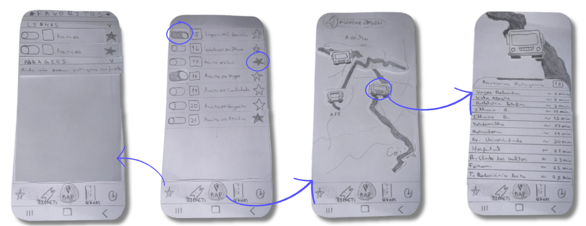

[Back to main Logbook Page](../hci_logbook.md)

---
# Low Fidelity Prototype and Evaluation

## D.1. Low Fidelity Prototype

Our low fidelity prototype was created using paper sketches, which allowed us to quickly visualize and test the basic structure and flow of our bus application. This approach enabled us to focus on the core functionalities and user interactions without worrying about detailed design elements. Using this paper prototype helped us gather early feedback on the usability and navigation of the app, making it easier to identify potential issues and improvements before moving on to higher fidelity versions. The prototype included screens such as bus route selection, timetable viewing, notification setting, lines visualization and ticket purchasing, providing a clear overview of the user trip.
## D.2. Prototype Evaluation
The evaluation was conducted both in the classroom and outside of it. Approximately 10 people tested the prototype, mainly individuals from the HCI (Human-Computer Interaction) field.

Based on their feedback and our observations during testing, we identified several key improvements and considerations for the application:

- When pressing the “+” button to plan a trip;
 - Combining the “Recents” and search to improve usability;
- The “Sort by” feature should open a selection window with sorting options;
- Both bus stops and buses with live tracking should appear on the map. Users should be able to tap on bus stops to see more information;
- Passenger characteristics (e.g., discounts) should be taken into account during ticket purchase, possibly as an additional step;
- After purchasing a ticket, the app should display the ticket on the confirmation screen;
- Notifications for tickets or bus lines should be configurable by time, and clearly specify the bus line in the notification;
- Rename “Recharge” to “Renew” for clarity;
- Add a “View Map” button when selecting bus lines;
- Filter bus stops during live tracking when selecting a bus;
- The options for a bus line should be more clearly accessible;
- Consider adding a trip history tab (possibly in the tickets section);
- Include confirmation pop-ups when adding favorites;
- Add back buttons for easier navigation;
- Show the user’s current location on the map;
- Avoid overwhelming the user with too much information; only essential data should be shown.

So, this points were taken in consideration while high fidelity prototype.
---
[Back to main Logbook Page](../hci_logbook.md)

---